# 🚀 BizPilot

A modern WPF application for managing customers, appointments, services, and users — built for small business owners like barbershops and local service providers.

## 🛠️ Tech Stack

- 👨‍💻 C# (.NET)
- 🖥️ WPF (Windows Presentation Foundation)
- 🗃️ SQLite for local data storage
- 📐 MVVM (Model-View-ViewModel) Architecture

---

## ✨ Features

- 🔐 User Authentication
- 📅 Appointment Scheduling with customer selection and time/date pickers
- 👥 Customer Management with detailed forms
- 🛠️ Services Management
- 👤 User Roles & Access Control
- 🎨 Light/Dark Mode Toggle
- 🌍 Language Selection (Planned)
- 📊 Clean Dashboard with dynamic statistics

---

## 🖼️ Screenshots

### 🔐 Login Page
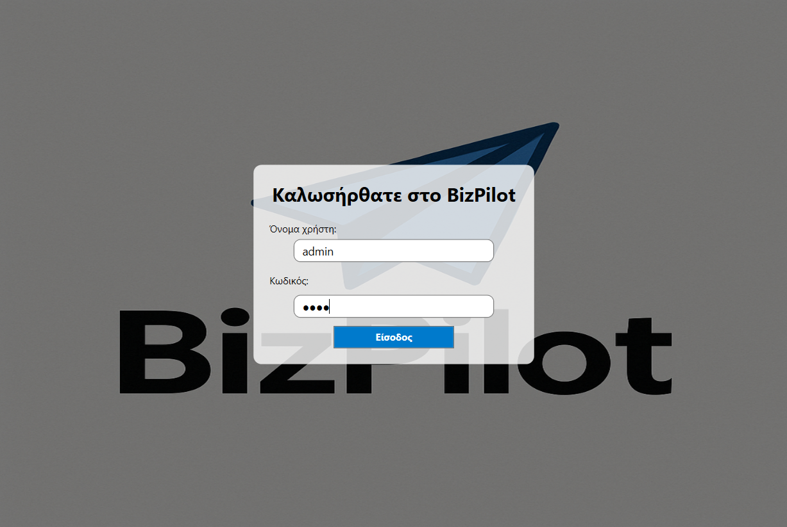

### 🏠 Homepage (Dashboard)
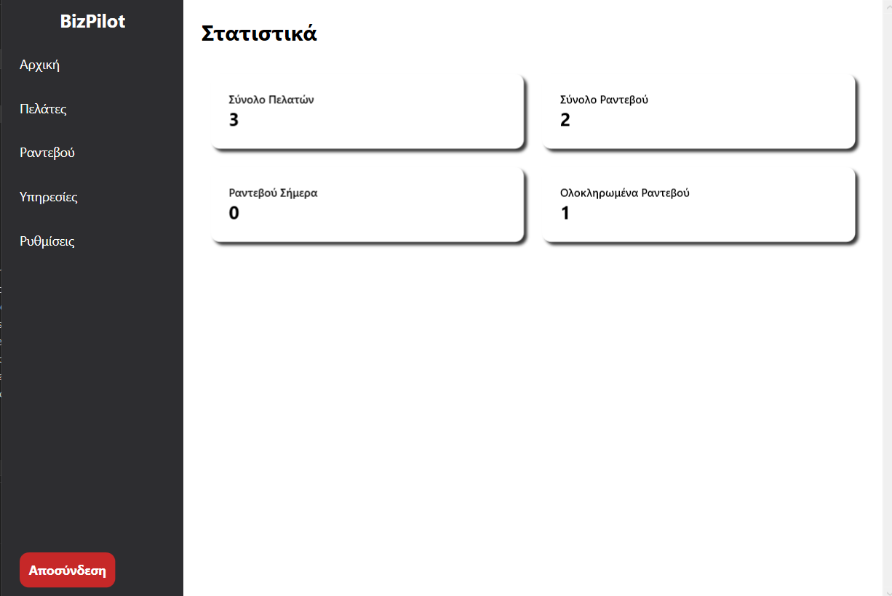

### 👥 All Customers
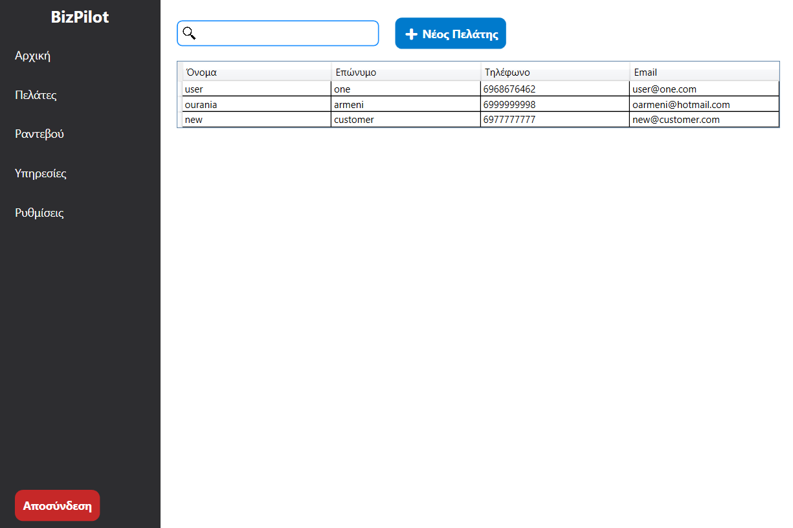

### ➕ Add New Customer
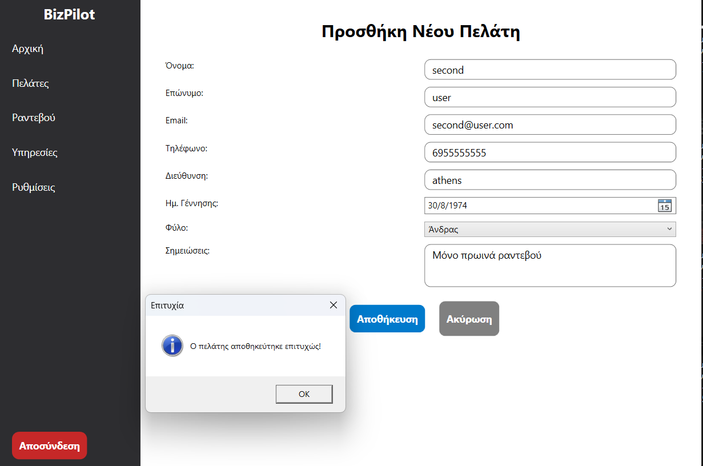

### 📅 Appointments
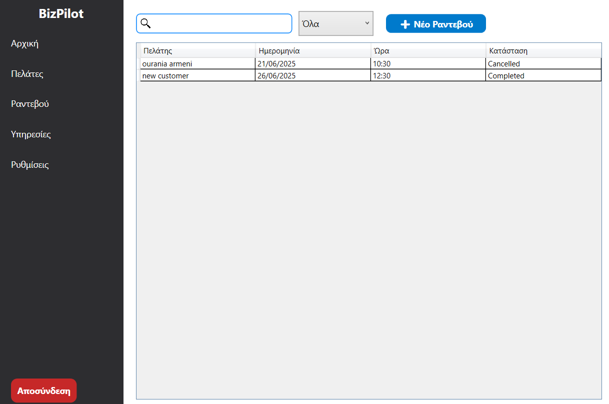

### ➕ Add New Appointment
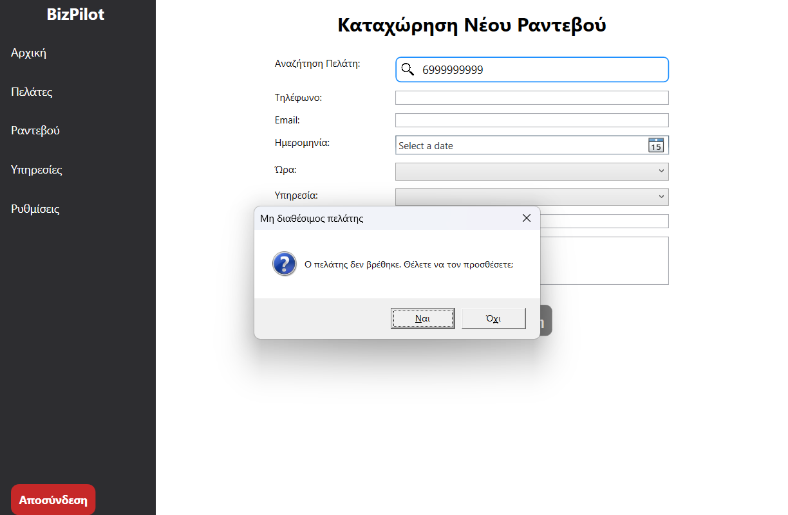

### ⚙️ Appearance Settings
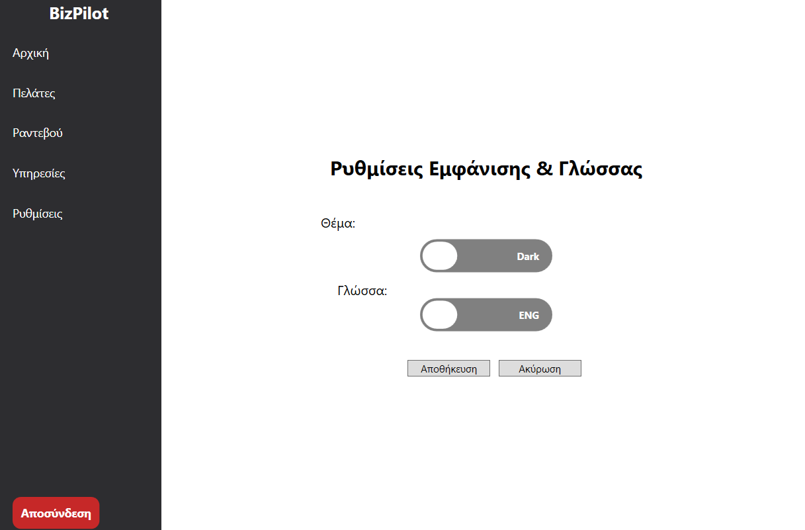

### ➕ Add New Service
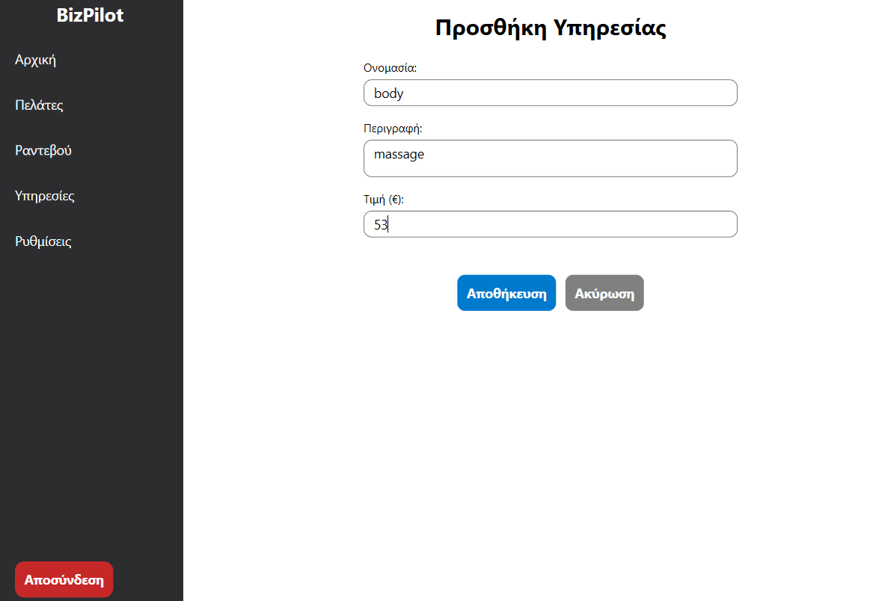

### ➕ Add New User
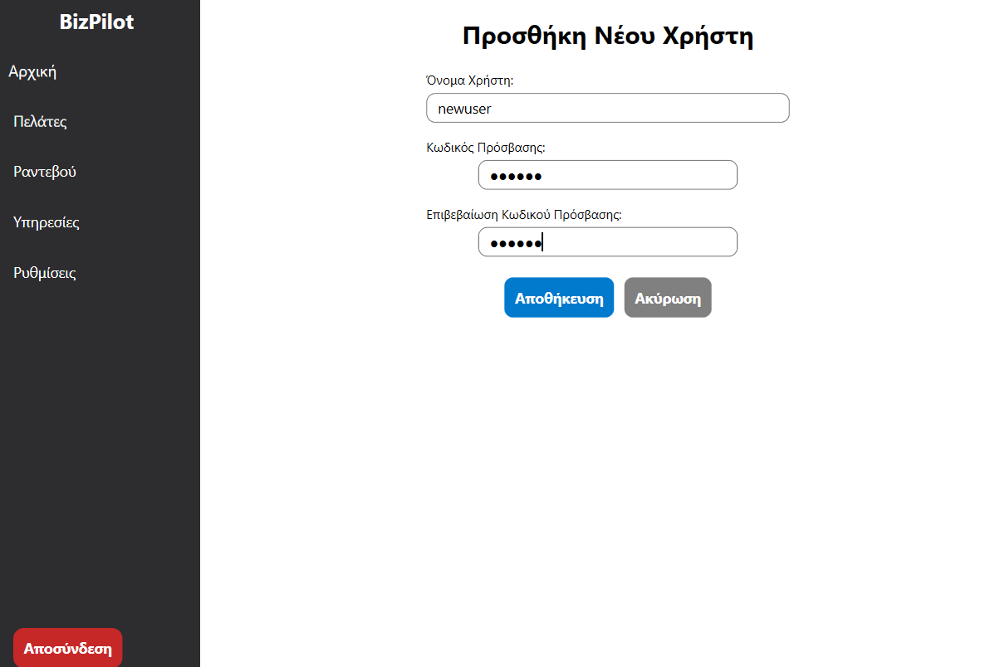

### ⚙️ Settings
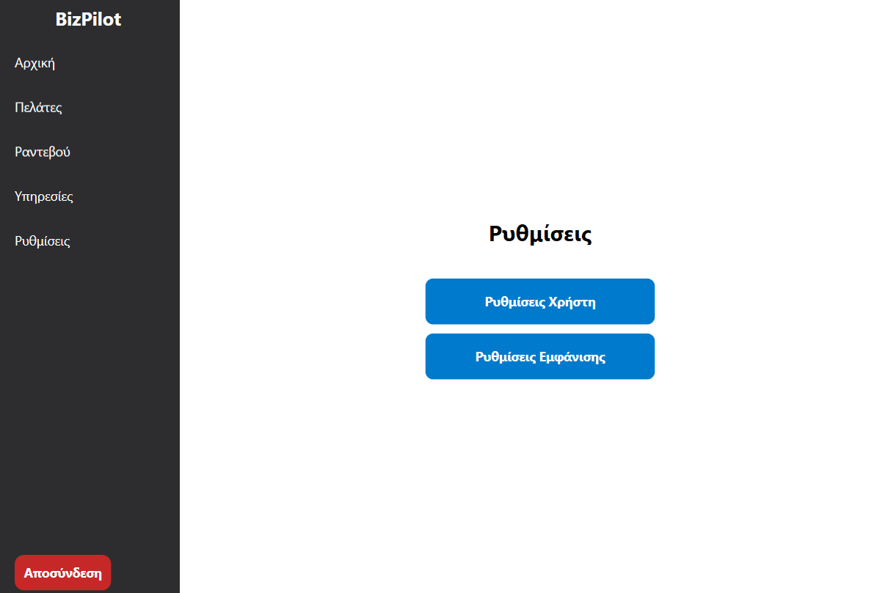

### 👤 Users Management
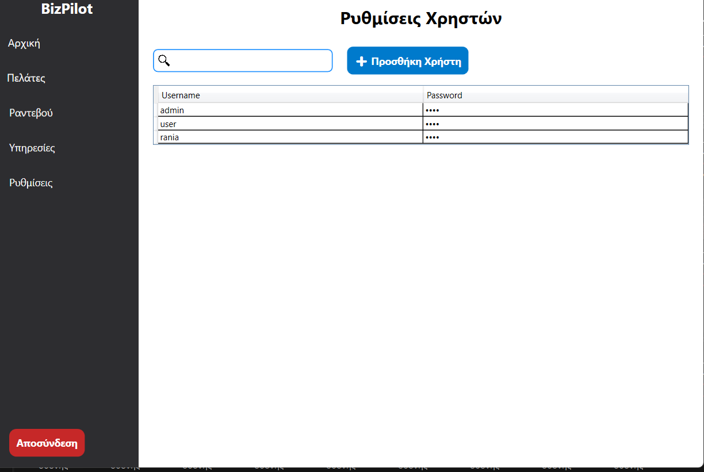

---

📌 Notes
This project is under active development.

Data is stored locally using SQLite.

Localization and export features are planned.
